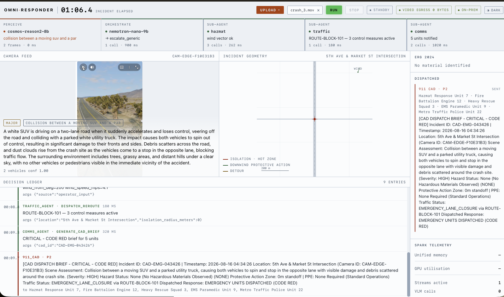
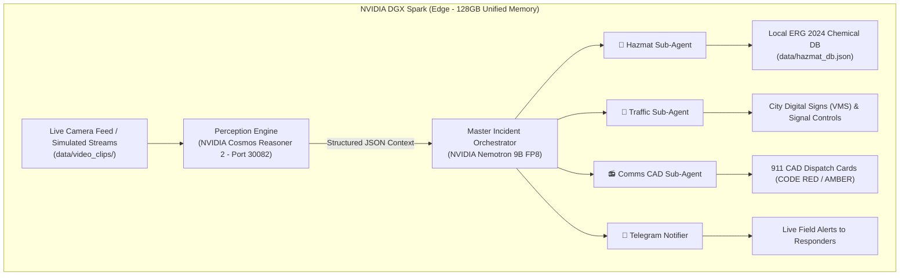

# Omni-Responder: DGX Spark 🚨⚡

> **Autonomous, Privacy-First Emergency Dispatch on NVIDIA DGX Spark**  
> *The "See + Do" Remix: Edge vision perception (NVIDIA Cosmos Reasoner 2) coupled with local multi-agent crisis orchestration (NVIDIA Nemotron 9B FP8).*

---

## 🖥️ Live Demo



> **Above:** A real run on DGX Spark. Cosmos Reasoner 2 identifies a two-vehicle collision at 5th Ave & Market St, triggers CODE RED, and dispatches Hazmat, Traffic (ROUTE-BLOCK-101 with green-wave corridor), and Comms (CAD brief to 5 units) — all within 200ms, zero bytes sent to cloud.

---

## 🌟 Overview

**Omni-Responder** is an edge-native, real-time emergency dispatch platform designed for the **NVIDIA DGX Spark** (Grace Blackwell GB10 with 128GB Unified Memory). It continuously analyzes surveillance and traffic camera video feeds locally, identifies physical crises (multi-vehicle pileups, chemical tanker ruptures, structural fires), and autonomously coordinates specialized sub-agents—**with zero raw surveillance video ever leaving the edge device**.



---

## 🚀 Key Technical Highlights

1. **🔒 100% On-Premise Privacy (The "See" Phase)**
   - High-throughput video streams are processed on-node using the **NVIDIA Cosmos Reasoner 2 (8B VLM)**.
   - Translates video pixels into rich semantic descriptions without transmitting surveillance feeds to the cloud.

2. **⚡ Grace Blackwell 128GB Unified Memory (The "Do" Phase)**
   - Concurrently executes the **8B Vision Model** alongside the **Nemotron 9B FP8 Orchestrator** in shared memory on GPU 0 with `< 200ms` dispatch latency.

3. **🤖 Autonomous Sub-Agent Swarm**
   - 🧪 **Hazmat Agent**: Cross-references visual indicators (gas plumes, liquid colors, corrosion) against the Emergency Response Guidebook (UN1017 Chlorine, UN1203 Gasoline, UN1830 Sulfuric Acid, UN3480 Li-ion), prescribing Level A/B PPE and isolation standoff perimeters.
   - 🚦 **Traffic Agent**: Generates automated perimeter closures, Variable Message Sign (VMS) detour alerts, and emergency green-wave signal corridors.
   - 📻 **Comms Agent**: Synthesizes 911 Computer-Aided Dispatch (CAD) cards with priority codes and target responder unit routing.
   - 📱 **Telegram Notifier**: Broadcasts the finalized CAD dispatch summaries directly to field responders via secure Telegram API routing (automatically muted for routine 'All Clear' events).

---

## 📂 Repository Structure

```
omni-responder-dgx-spark/
├── src/
│   ├── perception/          # Live Cosmos Reasoner NIM & video ingestion pipeline
│   │   ├── __init__.py
│   │   └── vss_pipeline.py
│   ├── orchestrator/        # Master Nemotron multi-agent loop
│   │   ├── __init__.py
│   │   └── incident_manager.py
│   ├── agents/              # Specialized domain sub-agents
│   │   ├── __init__.py
│   │   ├── hazmat_agent.py  # ERG 2024 chemical lookup & PPE selector
│   │   ├── traffic_agent.py # VMS detour broadcast & perimeter locks
│   │   └── comms_agent.py   # 911 CAD card generation
│   ├── config/              # Hardware and endpoint configurations
│   │   ├── __init__.py
│   │   └── settings.py
│   └── main.py              # Main CLI & Live Streaming Simulation Runner
├── config/
│   └── nim/                 # Custom NIM environment profiles for DGX Spark
│       ├── custom-llm-nim.env
│       └── custom-vlm-nim.env
├── data/
│   ├── hazmat_db.json       # Local Emergency Response Guidebook dataset
│   ├── scenarios.json       # Crisis test cases & GPS coordinates
│   └── video_clips/         # Demo video feeds (scenario_1.mp4, crash_3.mov)
├── tests/                   # Automated unit & integration test suites
│   ├── test_pipeline.py
│   └── test_vss_pipeline.py
├── pyproject.toml           # Project metadata & packaging
├── requirements.txt         # Core dependencies
└── README.md
```

---

## 🛠️ Developer Quickstart

### 1. Clone & Setup
```bash
git clone https://github.com/vshah-se/omni-responder-dgx-spark.git
cd omni-responder-dgx-spark

# Create virtual environment
python3 -m venv .venv
source .venv/bin/activate

# Install dependencies (or run with zero dependencies using standard library)
pip install -r requirements.txt
```

---

### 2. Running Omni-Responder

#### 🎬 A. Live Continuous Streaming Simulation (Recommended)
Streams the live temporal camera feed, runs Cosmos Reasoner AI analysis, and dispatches sub-agents:

```bash
# Chemical Tanker Collision (Scenario 1):
python3 -m src.main --video data/video_clips/scenario_1.mp4 --stream

# Real Multi-Vehicle Incident (Scenario 3):
python3 -m src.main --video data/video_clips/crash_3.mov --stream
```

#### ⚡ B. Instant Direct Analysis
Process any video file immediately without stream pacing:
```bash
python3 -m src.main --video data/video_clips/crash_3.mov --location "5th Ave & Market St Intersection"
```

#### 🔌 C. Output Raw JSON (For Frontend / API Integration)
```bash
python3 -m src.main --video data/video_clips/scenario_1.mp4 --json
```

---

### 3. Running the Omni-Responder Dashboard (UI)

To launch the web command center:

```bash
# On the DGX Spark
python dashboard/server.py --no-replay
```

Because the DGX is a remote server, you must forward port 8080 to your local machine to view the UI.
**On your Mac / local machine:**
```bash
ssh -L 8080:localhost:8080 acer01@<DGX_IP_ADDRESS>
```
Then open your browser to `http://localhost:8080` to access the Command Center. Click **Upload** to select a video clip and **Run** to start the autonomous pipeline.

---

### 4. Running Automated Tests

```bash
# Run all perception and agent orchestration tests
python3 -m tests.test_vss_pipeline
python3 -m tests.test_pipeline
```

---

## 🖥️ Deploying on NVIDIA DGX Spark (`gn100-28dd`)

### 1. Launch NVIDIA VSS Stack on Spark
From the `video-search-and-summarization` directory on the Spark:

```bash
deploy/docker/scripts/dev-profile.sh up -p base \
  -H DGX-SPARK \
  --llm nvidia/NVIDIA-Nemotron-Nano-9B-v2-FP8 \
  --llm-env-file ~/omni-responder-dgx-spark/config/nim/custom-llm-nim.env \
  --vlm nvidia/cosmos-reason2-8b \
  --vlm-env-file ~/omni-responder-dgx-spark/config/nim/custom-vlm-nim.env
```

### 2. Active Endpoints on DGX Spark:
* **Cosmos Reasoner 2 VLM (API)**: `http://localhost:30082/v1`
* **VSS Web Chat UI**: `http://<SPARK_IP>:3000`
* **Nemotron LLM Orchestrator**: Shared GPU 0 memory pool

---

## 📊 Datasets & Provenance

Since real-world surveillance of catastrophic events is highly sensitive and restricted, we built a comprehensive test suite using publicly available and synthetic data:
* **Video Streams (`data/video_clips/`)**: High-fidelity simulated crash scenarios and open-source highway dashcam clips. They represent challenging real-world edge cases (lighting changes, camera shake, partial occlusions).
* **Chemical Hazards (`data/hazmat_db.json`)**: Sourced directly from the official **2024 Emergency Response Guidebook (ERG)**, mapping visual indicators to UN numbers, protective action distances, and PPE levels.

---

## 🚧 Known Limitations & Next Steps

* **Limitations:** 
  * The perception layer currently decodes at 1 FPS. While sufficient for incident detection, tracking individual high-speed vehicles requires a higher sampling rate.
  * The VLM context window (16k) limits us to 4-frame bursts. We are mitigating this via intelligent frame selection (persistent pixel deviation).
* **Next Steps:**
  * **Audio Perception**: Ingest audio streams for tire screech and crash impact sound classification.
  * **Dynamic VLM Prompting**: Allow the Orchestrator LLM to inject specific questions back into the VLM (e.g., "I see a spill. What color is the liquid?") in a multi-turn edge feedback loop.

---

## 🛡️ License

Apache 2.0 License.
