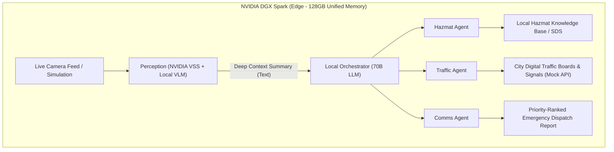

# Omni-Responder: DGX Spark 🚨⚡

> **Autonomous, Privacy-First Emergency Dispatch on NVIDIA DGX Spark**  
> *The "See + Do" Remix: Edge vision perception coupled with local multi-agent incident orchestration.*

---

## 🌟 Overview

**Omni-Responder** is an autonomous, edge-native emergency dispatch system. It processes real-time surveillance/traffic camera feeds directly on local NVIDIA DGX Spark hardware, identifies physical crises (e.g. multi-vehicle collisions, hazardous chemical spills, fires), and coordinates specialized autonomous sub-agents—**all without transmitting raw video feeds to the cloud**.



---

## 🚀 Key Features

1. **Edge-Native Privacy ("The See Phase")**
   - Utilizes the **NVIDIA Visual Storage & Search (VSS) Spark Playbook** to ingest and process high-throughput camera streams locally.
   - Local **Vision-Language Model (VLM)** translates complex video events into high-density semantic situation descriptions (e.g., *"Intersection blocked. Two vehicles involved. Unknown green chemical leaking from commercial truck tanker"*).
   - Zero raw video egress to the cloud ensures strict compliance and citizen privacy.

2. **Unified Memory Agent Orchestration ("The Do Phase")**
   - Powered by the DGX Spark's **128GB Unified Memory on NVIDIA Grace Blackwell architecture**.
   - Concurrently executes high-parameter Vision Models alongside **70B parameter LLM Orchestrators** without memory bottlenecks.

3. **Specialized Autonomous Sub-Agents**
   - 🧪 **Hazmat Agent**: Cross-references visual descriptions, placard numbers, and leak characteristics against localized chemical safety databases (ERG / SDS).
   - 🚦 **Traffic Agent**: Issues automated API commands to city signal systems, variable message signs (VMS), and navigation feeds to reroute approaching traffic.
   - 📻 **Comms Agent**: Synthesizes a structured, priority-ranked situational brief for 911 dispatchers, fire, EMS, and police units.

---

## 📂 Repository Structure

```
omni-responder-dgx-spark/
├── src/
│   ├── perception/          # Video ingestion, VSS pipeline & VLM inference
│   │   ├── __init__.py
│   │   └── vss_pipeline.py
│   ├── orchestrator/        # Master incident orchestration & agent loop
│   │   ├── __init__.py
│   │   └── incident_manager.py
│   ├── agents/              # Domain-specific sub-agents
│   │   ├── __init__.py
│   │   ├── hazmat_agent.py
│   │   ├── traffic_agent.py
│   │   └── comms_agent.py
│   ├── config/              # Hardware and endpoint configurations
│   │   ├── __init__.py
│   │   └── settings.py
│   └── main.py              # CLI and demonstration runner
├── data/
│   ├── hazmat_db.json       # Local Emergency Response Guidebook (ERG) data
│   └── mock_feeds/          # Sample crisis scenarios & synthetic feeds
├── tests/                   # Unit & integration test suites
├── requirements.txt         # Core dependencies
├── pyproject.toml           # Project metadata & build configuration
├── idea.md                  # Project concept document
└── README.md
```

---

## 🛠️ Getting Started

### Prerequisites
- Python 3.10+
- NVIDIA GPU with CUDA 12.x+ (Optimized for NVIDIA Grace Blackwell / DGX Spark)
- NVIDIA NIM / TensorRT-LLM / vLLM runtime

### Installation

```bash
# Clone the repository
git clone https://github.com/<your-username>/omni-responder-dgx-spark.git
cd omni-responder-dgx-spark

# Create and activate virtual environment
python3 -m venv .venv
source .venv/bin/activate

# Install dependencies
pip install -r requirements.txt
```

### Running the Demo Simulation

```bash
python -m src.main --scenario multi_vehicle_hazmat
```

---

## 🛡️ License

Apache 2.0 License. See `LICENSE` for details.
